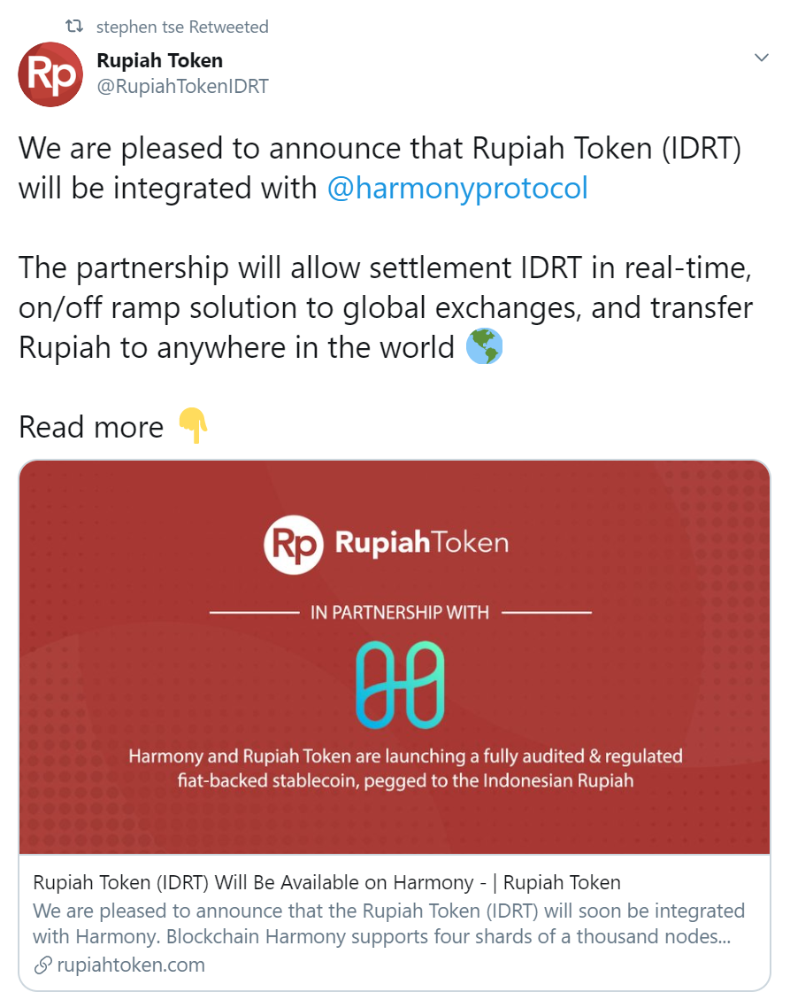
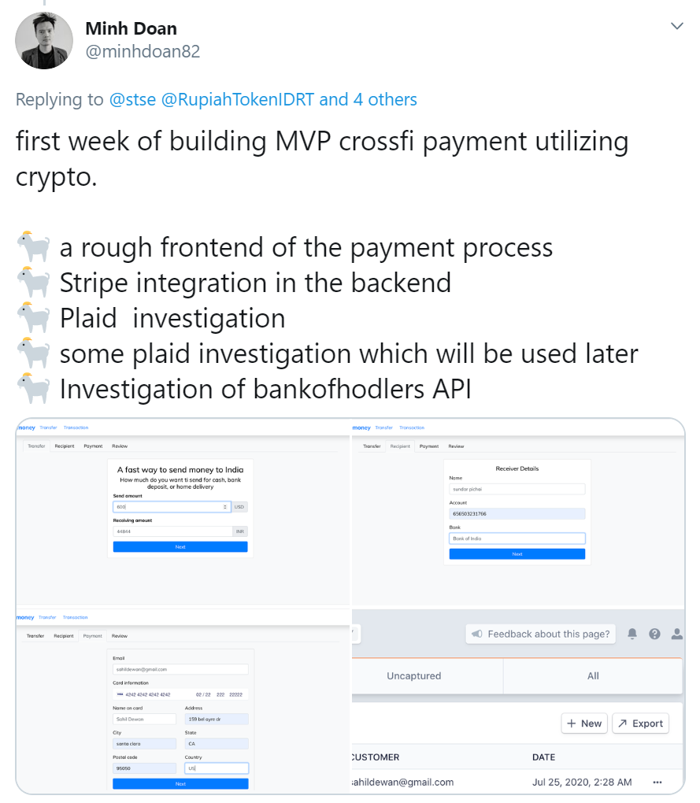

# Fiat

## \*\*\*\*[**CoinDCX**](https://coindcx.com/)\*\*\*\*

CoinDCX is the first hybrid crypto exchange. It's an all inclusive cryptocurrency ecosystem that offers professional trading experience to all types of traders. Trade 100+ cryptocurrencies like BTC, ETH, XRP and ONE! CoinDCX now supports ONE/INR, ONE/BTC, & ONE/USDT. 

## [Rupiah Token](https://rupiahtoken.com/)

Rupiah Token \(IDRT\) enables you to use Indonesian Rupiah directly on top of Ethereum & Binance and Harmony Chain. You can use IDRT to trade with many Crypto-Exchange Partners.

## Moneyhome

Instant cross-border payments using stablecoins such as BUSD, specifically in the USD&lt;&gt;INR corridor.

