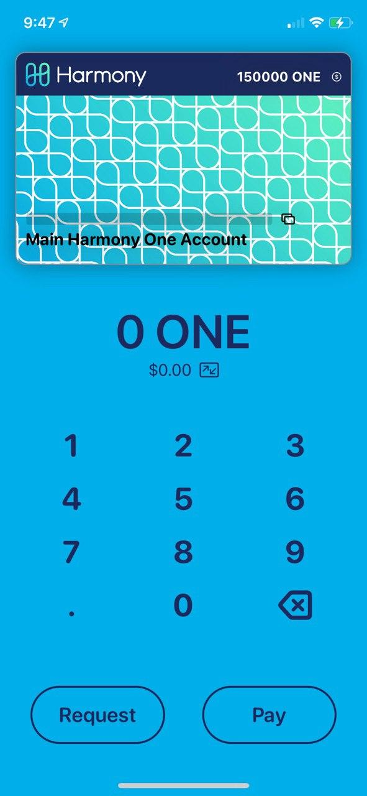
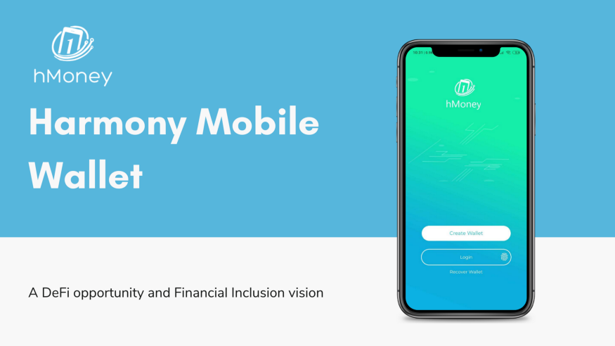
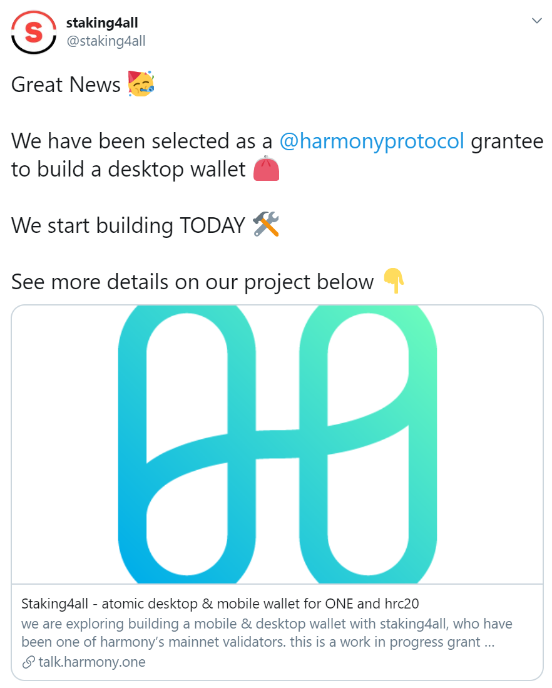

# Grants

## [Ript](https://ript.io/)

The Contractor: contract interaction tool to help users interact with their tokens and contracts easily without any technical knowledge.

## [Jelly Swap](https://jelly.market/)

Platform for ONE token holders to convert their tokens into other crypto and fiat pairs with atomic swaps.

## Moneyhome

Instant cross-border payment using stablecoins such as BUSD, specifically in the USD&lt;&gt;INR corridor.

## [Vivo](https://www.vivopay.me/)

Easiest ONE wallet for iphone, ipad and mac; used by consumers to pay each other, a la venmo.

## hMoney

Wallet with ONE and hrc20 support, qr code support and walletconnect api. Also staking, delegating, rewards claim features.

## uTrade \(Sesameseed\)

Decentralized exchange for HRC20 token holders to convert tokens through automated price discovery, liquidity pools.

## [Smartstake](https://harmony.smartstake.io/)

Responsive web application and telegram bot for assessing validator performance, delegations, rewards, rewards history, and network health.

## [Staking4All](https://www.staking4all.org/)

Desktop wallet with staking to delegate/undelegate and claim rewards.

