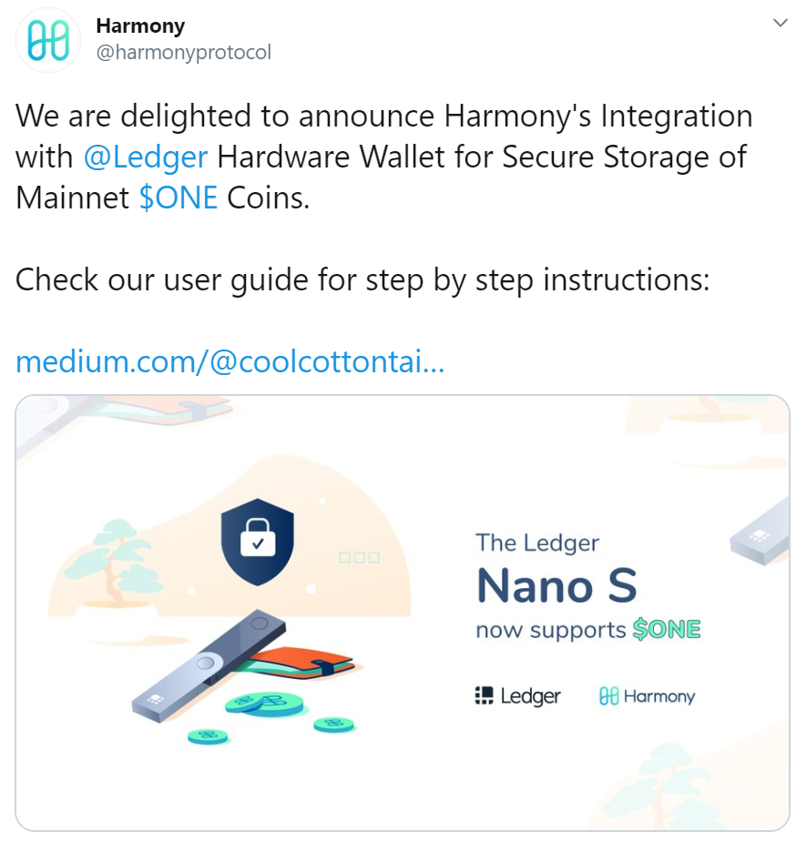

# Hardware Wallets

## [Ledger](https://www.ledger.com/)

Ledger hardware wallets are a series of multicurrency wallets that are used to store private keys for cryptocurrencies offline.

## [Safepal](https://www.safepal.io/)

SafePal securely stores your crypto assets in the most simple and easy way.

