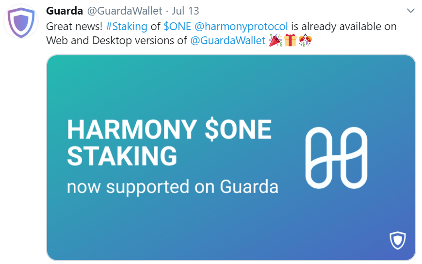
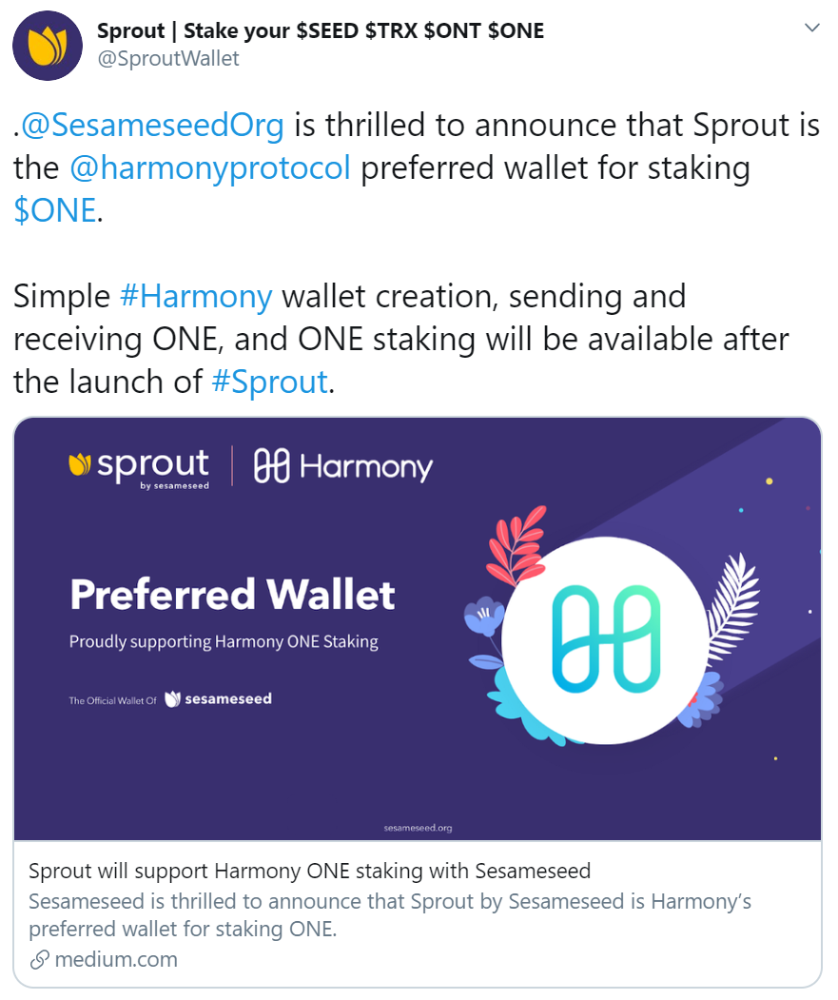

# Staking Wallets

### [Guarda](https://guarda.com/)

Simple and secure wallet for Bitcoin, Ethereum, Tether, EOS, TRON and hundreds of other assets. Buy, earn and exchange crypto. Staking, multisignature, Ledger compatibility. Harmony ONE staking is now supported.

### [Cobo Wallet](https://cobo.com/)

Cobo is the first leading wallet company in the world to offer Staking and masternode rewards on user holdings, making it easy for users to grow their digital assets effortlessly. As a company, they emphasize long-term security, reliability, and convenience. ONE is now supported.

### [Sprout](https://sprout.sesameseed.org/)

Sprout is a comprehensive, decentralized blockchain tool designed to provide a simple and secure blockchain experience to holders of digital assets. Sprout is built as the premiere staking wallet to stake and earn digital assets. It seeks to motivate beginner and advanced coin holders to stake them directly on the blockchain. ONE is now supported.

