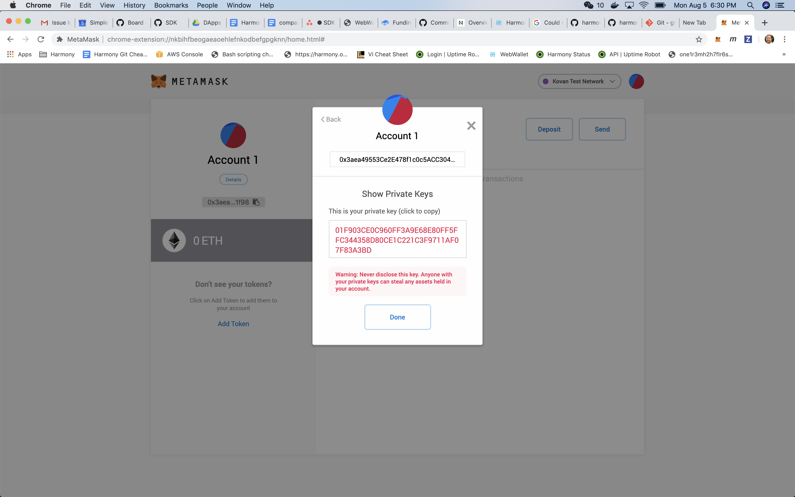

# Funding your wallet

## Finding your private key

To find your key open metamask and enter your passphrase to create a new wallet

Select the first account and export your private key e.g. `01F903CE0C960FF3A9E68E80FF5FFC344358D80CE1C221C3F9711AF07F83A3BD`



Whilst using metamask it is also good practice to set up a Harmony local network with the following information.


You can check your wallet is aligned with metamask by running the following command from the command line wallet.

```text
johns-mbp:harmony johnwhitton$ ./bin/wallet format --address one18t4yj4fuutj83uwqckkvxp9gfa0568uc48ggj7
account address in Bech32: one18t4yj4fuutj83uwqckkvxp9gfa0568uc48ggj7
account address in Base16 (deprecated): 0x3aea49553Ce2E478f1c0c5ACC304a84F5F4d1f98
```

## Transferring funds to your wallet


Currently we are not initializing the distributed ledger with default accounts and balances. Therefore you will need to run the harmony node for a couple of minutes to give it time for the validator accounts to earn rewards. Once they have earned rewards you may transfer them to your new account.


The following commands will show you the validator nodes balances

```text
./bin/wallet -p local balances
```

Select an account which has a balance of ONE's

```text
Account 14:
    Address: one1pdv9lrdwl0rg5vglh4xtyrv3wjk3wsqket7zxy
    Balance in Shard 0:  93.6, nonce: 0
    Balance in Shard 1:  0.0000, nonce: 0
```

Transfer 50 ONE's from this account to your wallet as follow

```text
johns-mbp:harmony johnwhitton$ ./bin/wallet -p local transfer --from one1pdv9lrdwl0rg5vglh4xtyrv3wjk3wsqket7zxy --to one18t4yj4fuutj83uwqckkvxp9gfa0568uc48ggj7 --amount 50

Using local profile for wallet
Unlock account succeeded! ''
Transaction Id for shard 0: 0x44913e6b97f8971ab3cc57e0189ee391b976bef00c697cb9fa8d4e4b2368a347
```

Check the tokens have been transferred as follows

```text
ohns-mbp:harmony johnwhitton$ ./bin/wallet -p local balances --address one18t4yj4fuutj83uwqckkvxp9gfa0568uc48ggj7
Using local profile for wallet
Account: one18t4yj4fuutj83uwqckkvxp9gfa0568uc48ggj7:
    Balance in Shard 0:  100.0000, nonce: 0
    Balance in Shard 1:  0.0000, nonce: 0
```


Note if you have restarted the harmony node you need to reset the nonce for the account this is currently done by opening up the developer tools in the browser and clearing local storage.

`localStorage.clear()`


### Checking your balances

