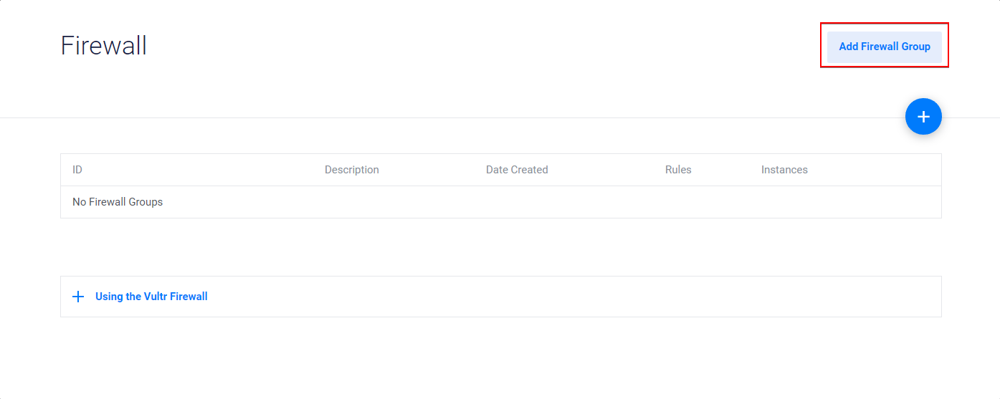
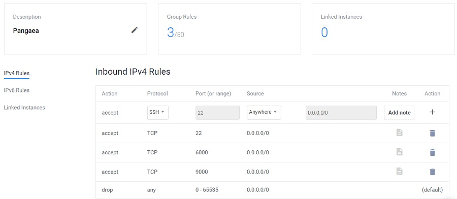
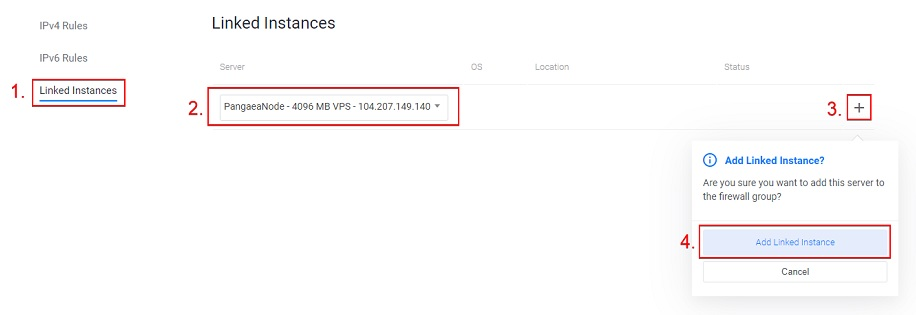
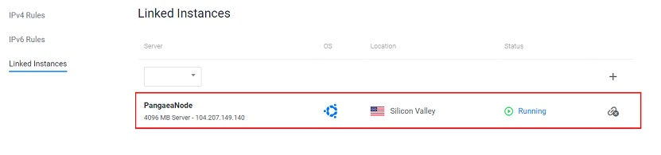
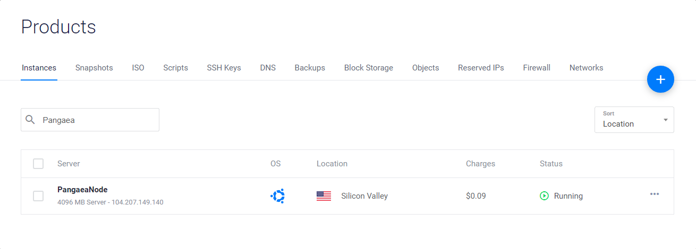

# Vultr

## **Step 1: Launching Your Vultr Instance** <a id="step-1-launching-your-vultr-instance"></a>

### Logging into Vultr <a id="logging-into-vultr"></a>

​First, go to the [Vultr Main Page](https://www.vultr.com/). If you don’t already have an Vultr account, register one by clicking on "Sign up". Otherwise, log into your Vultr Account by clicking on "Sign in".


### Create a new instance <a id="create-a-new-instance"></a>

Once logged in, you'll want to add a new instance. Depending on whether your account is new or not, you may or may not have a Products page.

* If you already have an instance, click the "+" button to deploy a new server. You can also use this [link](https://my.vultr.com/deploy/) to go to the deploy page.
* Otherwise, your Products page will be already link you to the Deploy page.


### Choose Instance Type <a id="choose-instance-type"></a>

For Pangaea requirements, two instance types would fit: Cloud Compute and High Frequency. Cloud Compute is recommended for Pangaea.

* **Cloud Compute instances** also work properly with 2 CPUs, 4 GB RAM with 80 GB SSDs.
* **High Frequency Instances** were recently introduced by Vultr and offer latest generation high performance 3GHz+ CPUs and NVMe SSDs.


### Select Server Location and Server Type <a id="select-server-location-and-server-type"></a>

Choose now your desired server type. We recommend either the latest **LTS version of Ubuntu** \(18.04 as of date of now\) or the latest version of **Debian**.


### Choose Server Size <a id="choose-server-size"></a>

Harmony recommends one of the two following:

**Cloud Compute**

* 2 CPU, 4 GB RAM, 80 GB SSD

**High Frequency**

* 2 CPU, 4 GB RAM, 128 GB NVMe SSD

For "Additional Features", none of the selections are necessary.


### Setting Server Name <a id="setting-server-name"></a>

You can now set the name of your server, e.g. PangaeaNode Then you should click "Deploy Now".


At this point you should be back on the Products page and your server should be installing. However, the setup isn't completely done, as you need to still create a firewall.

### Firewall Setup <a id="firewall-setup"></a>

As we want to allow other nodes to connect to yours, we have to open the correct ports.

Once you are on the [Firewall page](https://my.vultr.com/firewall/), click Add Firewall Group.



Enter a name for the firewall group, e.g. FoundationNode.

#### Open the following 3 ports to the public \("Anywhere" on inbound\). <a id="open-the-following-5-ports-to-the-public-anywhere-on-inbound"></a>

* TCP 22 \(SSH\)
* TCP 6000
* TCP 9000

Make sure to check that 3 Group Rules have been set.



#### Then link the instance to the firewall group. The steps are as follows: <a id="then-link-the-instance-to-the-firewall-group-the-steps-are-as-follows"></a>

1. Click Linked Instances.
2. Make sure your new server is selected.
3. Click the + button.
4. Click Add Linked Instance.



Your instance should now be added to the firewall group and the number of linked instances should increment by 1.



You can now go back to the Products page and your server is now successfully set up!



## **Step 2: Connecting via SSH to your Instance** <a id="step-2-connecting-to-your-vultr-node"></a>

Follow the instructions below accordingly to the operating system you are connecting from:

* [Windows](https://www.vultr.com/docs/connecting-to-your-server-with-ssh-via-putty-on-windows)
* [Linux](https://www.vultr.com/docs/how-to-access-your-vultr-vps#SSH__Linux_)

## Step 3: Installing Required Packages

Before anything, it is recommended to update your system:

```bash
sudo apt update && apt upgrade
```

Now install the following packages that will be needed to run Harmony by typing:

```bash
sudo apt install dnsutils
```

You will be asked to confirm if you would like to download and install these packages. Just press Y to confirm.

