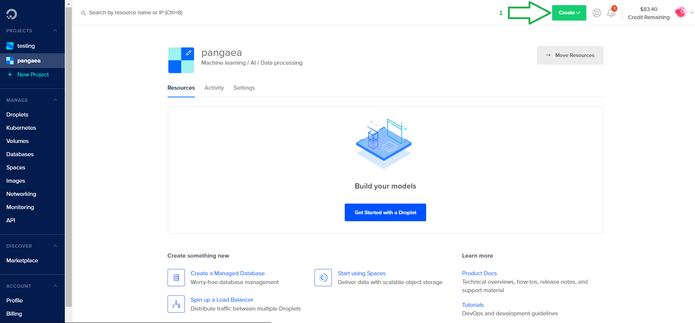
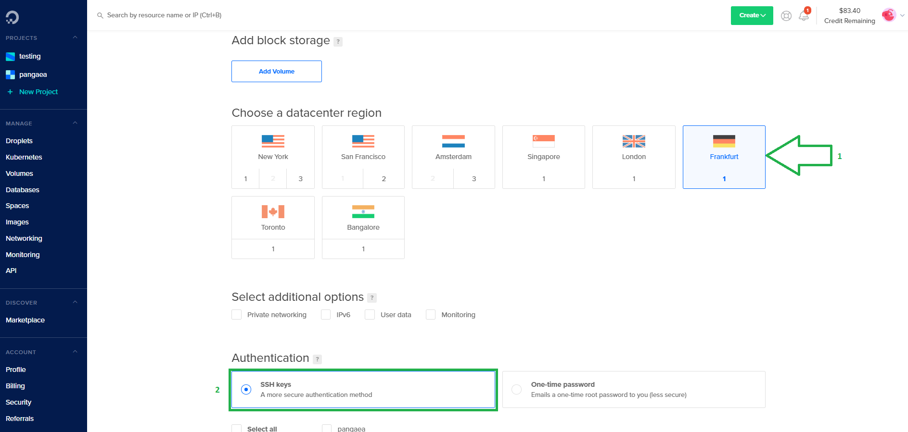
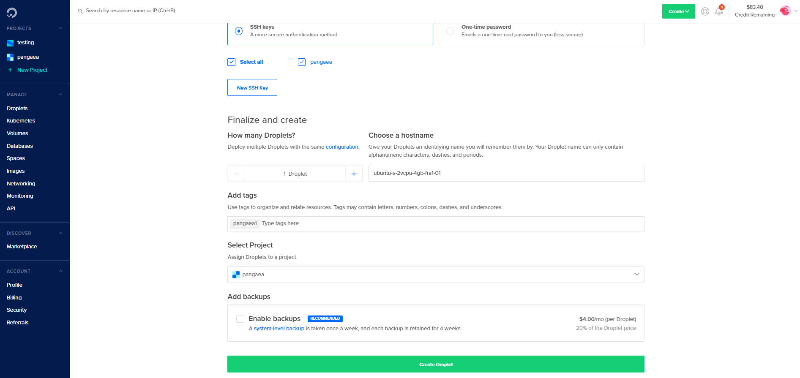
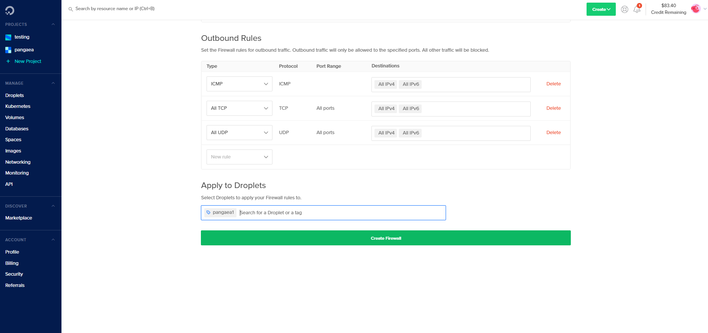

# Digital Ocean

To launch your Digital Ocean instance, we will go through 2 steps.

**Step 1: Launching your Digital Ocean Instance**

* Registering Digital Ocean and choosing the correct instance.

**Step 2: Connecting to your Digital Ocean Instance** 

* Connecting to your Digital Ocean instance 

## Step 1: Launching your Digital Ocean Node <a id="step-1-launching-your-aws-node"></a>

### Logging into **Digital Ocean** <a id="logging-into-vultr"></a>

[​Digital Ocean Main Page](https://www.digitalocean.com/) If you don’t already have an Digital Ocean account, register one by clicking on "Sign up". Otherwise, log into your Digital Ocean Account by clicking on "Sign in".

### Create a new P**roject** <a id="create-a-new-instance"></a>

Once you have set up and logged into your Digital Ocean account, click on the top left bar “Projects -&gt; New Project". Enter the desired project name and click on "Create Project" as shown by the image bellow:


### Create a new Droplet <a id="create-a-new-instance"></a>

On the top right corner click on "Create"-&gt;"Droplets".



Choose now your desired Linux image. We recommend either the latest **LTS version of Ubuntu** or the latest version of **Debian**. Use the left and right arrows to navigate between the different plans available. Choose the "Standard" plan and then select a virtual machine with at least 2 CPUs, 4GB of RAM and 80GB SSD.


You can select the datacenter region of your choice here. We chose "Frankurt" in our example. Use the "SSH Keys" as your authentication method \(more secure\). A button with the name "New SSH key" will appear on screen, just click on it.



Paste your public SSH key, give it a name and click on button "Add SSH key" as shown by the image bellow. In case you don't have a public SSH key yet, just follow the instructions to create it.


Choose a custom hostname if you want and then click on "Create Droplet".



### Setup the Firewall <a id="create-firewall-group"></a>

Wait a few seconds till your droplet is created and then click on "Networking" on the left bar.


Click on "Firewall" and then on "Create Firewall".


In the Inbound Rules section, click on "New rule" and select "Custom". Leave the protocol as **TCP** and fill the port range field with **6000**. Repeat the same procedure for port **9000**. You will be left with 2 inbound rules as shown by the image bellow.


In the Outbound Rules section leave it as it is. Type the name of the droplet you want to apply your firewall rules \(the droplet name is the same as your hostname you chose previously\).Click now on "Create Firewall".



## **Step 2: Connecting to your Digital Ocean Node** <a id="step-2-connecting-to-your-vultr-node"></a>

**Connect to your Digital Ocean Instance by using Git Bash.**

If you do not have gitbash installed. Please visit this [link to install](https://gitforwindows.org/). Everything can be default selection when you are installing.

Click on your project and then on Droplets. You will see the associated IP address of your selected droplet. Run the command bellow for your IP address on Gitbash:

```text
ssh root@<INSTANCEIPADDRESS>
```

It will the prompt you for the root password. Just login in using your credentials.


Before anything, it is recommended to update your system:

```bash
sudo apt update && apt upgrade
```

Now install the following packages that will be needed to run Harmony by typing:

```bash
sudo apt-get install dnsutils && sudo apt-get install tmux
```

You will be asked to confirm if you would like to download and install these packages. Just press Y to confirm.

