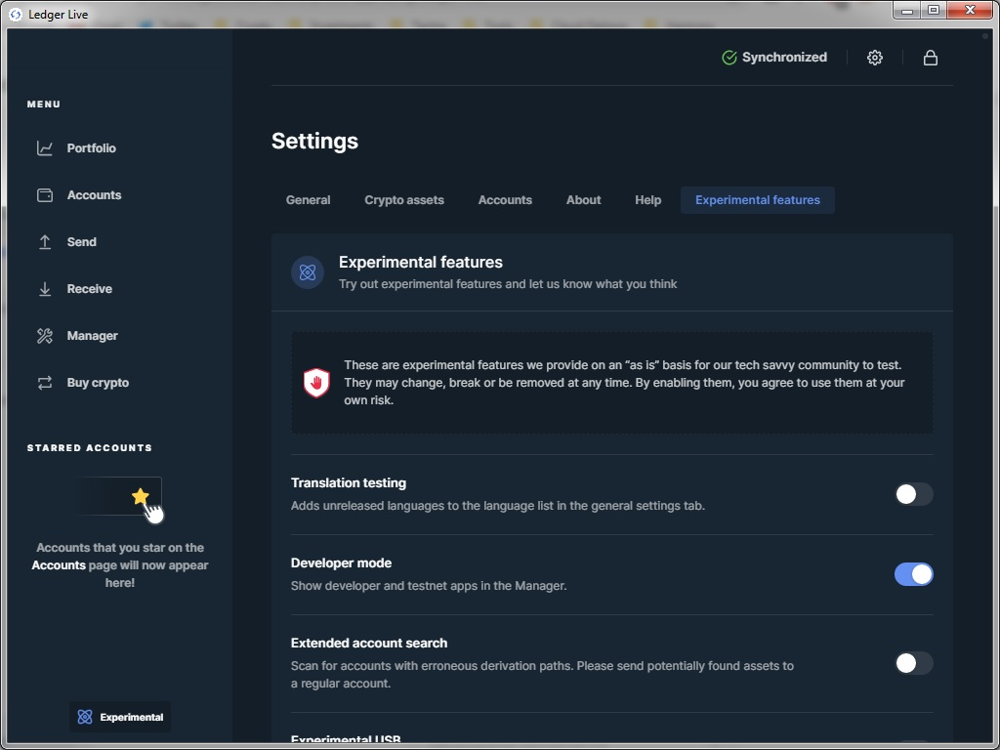
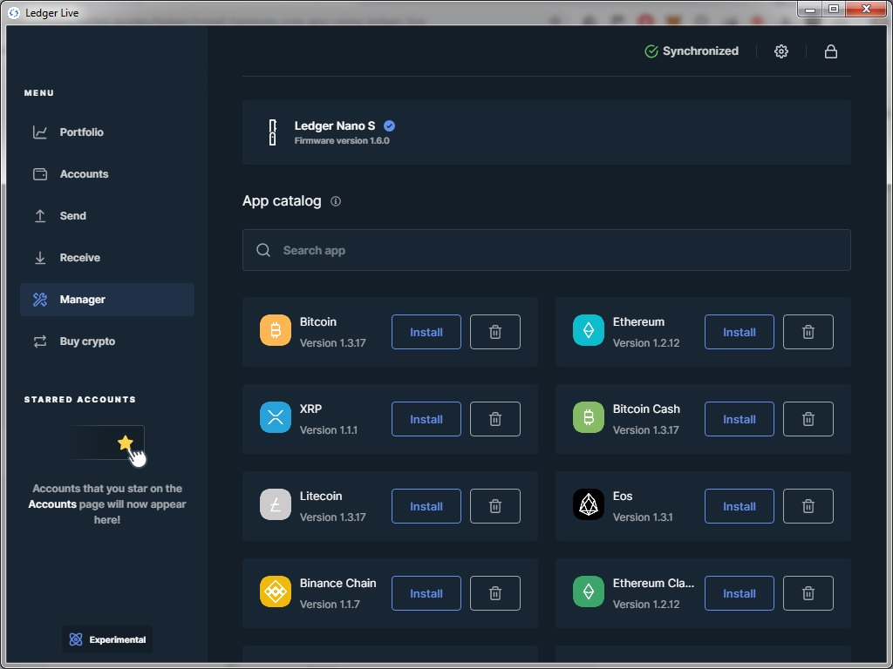
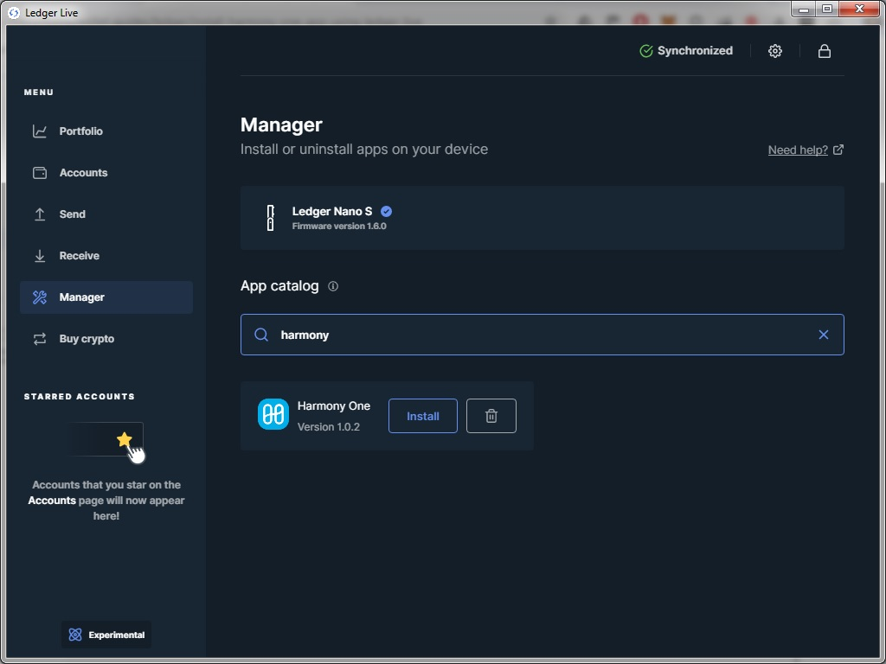

# Install Harmony One App using Ledger Live

**Step 1. Turn on Developer Mode in Ledger Live**

1. Download [Ledger Live](https://support.ledgerwallet.com/hc/en-us/articles/360006395553/) onto your computer. Ledger Live is the app you use to manage your Ledger device.  Please follow the official installation instruction [here](https://support.ledger.com/hc/en-us/articles/360006395553).
2. Open Ledger Live,  select Manager.  Turn on developer mode in Manager : Settings =&gt; Experimental Features =&gt; Developer Mode, as shown below:

**Step 2. Search for Harmony One App in Ledger App Catalog**

Ledger live provides app catalog for different types of apps, as shown below:  

To find the Harmony app, type **harmony** in the search bar, as shown below: 

**Step 3. Install/Remove Harmony One App**

There are two buttons associated with Harmony One app. The **install** button can be clicked to install Harmony One app to Ledger Nano.  The app can be uninstalled by clicking the trash bin button. 

**Step 4. Using Harmony One App**

To use Harmony One app,  please check your Ledger Nano device and click the buttons to open the app.

