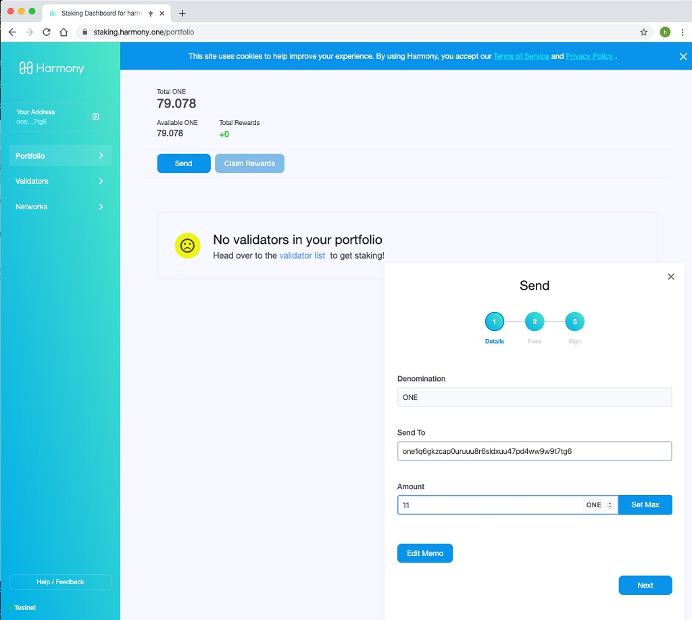

# Sending transactions

To send any token to an address, please click the send button and the send screen will display as the following:

Input the amount of tokens to send and the destination address, then click the next buttons until you see the send button. Click the send button as shown below: 

Check your ledger Nano S, the LED display on Nano S is shown as below.

Click the right button to start signing the transaction:

Check and confirm the transfer to address is correct:

Check and confirm the amount is correct:

Check and confirm the source shard ID is correct:

Check and confirm the destination shard ID is correct:

Detailed process is shown in video below:



On the computer, you will find that the transaction is sent and confirming: 

After a while, it will change to "Successful Send" 

