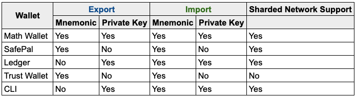

# Key Management Overview

Below is an index that shows you which wallets can allow to you import or export your account via mnemonic and private key, as well as which wallet has sharded network support. 

## Exchange Missing Funds

If you transfer funds to an Exchange Wallet using an incorrect shard, the funds will not show up, and you'll need to contact the exchange providing them the transaction ID. 

For Math Wallet: 

1. Go to [https://mathwallet.org/web/harmony](https://mathwallet.org/web/harmony), and log into your account 
2. Click on "Transactions", which will open Harmony's Explorer page 
3. Select the transaction in question, and copy the transaction ID to provide to the exchange you're in contact with 

Exchange Support:

[Binance](https://www.binance.com/en/support-center)  
[Bitmax](https://bitmaxhelp.zendesk.com/hc/en-us/requests/new)

