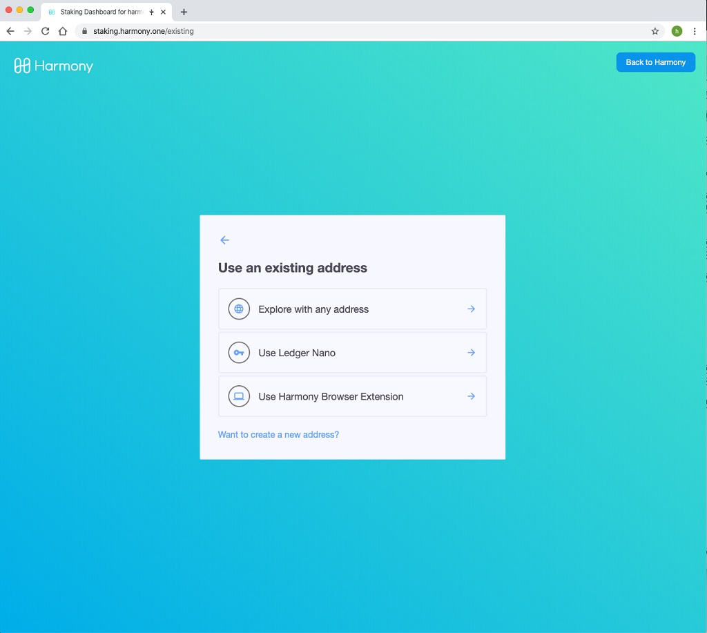
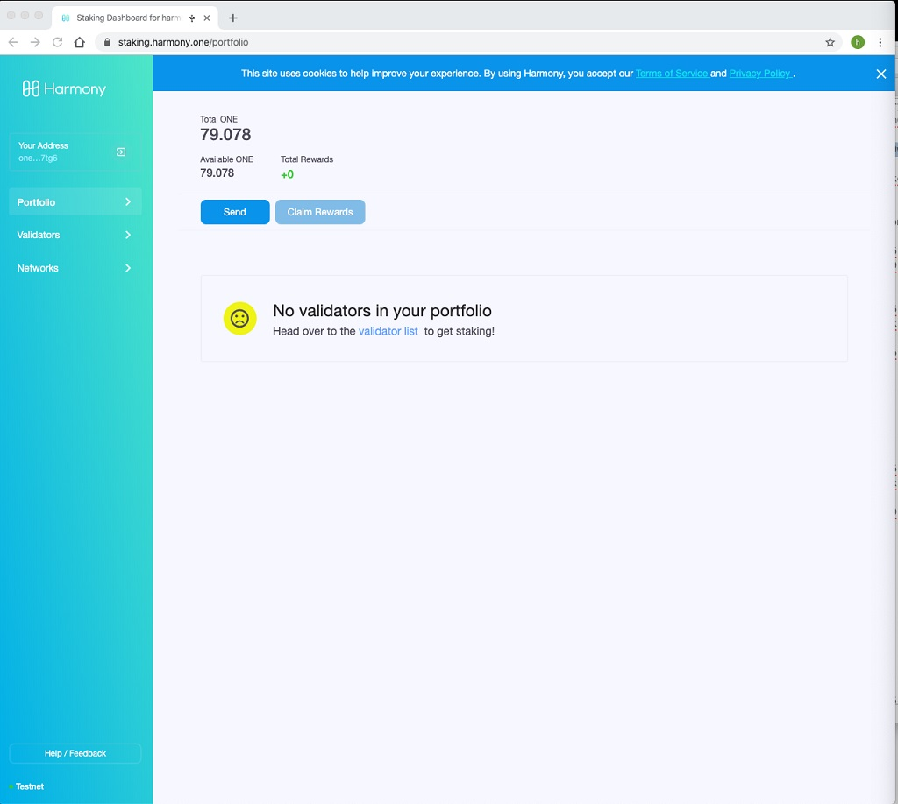

# Sign In With Ledger

The staking website is at [https://staking.harmony.one/ledger](https://staking.harmony.one/ledger) This site is used for staking and sending tokens. Open the site you will see the following:

Click the sign in button on the left side, and the signing methods will show up as below:

Click the "Use an existing address":

Click the "Use Ledger Nano" and it shows the following:

Click "Sign In" and check your Ledger Nano S. It should show "Display Address" on the LED like below:

There are two buttons on top of Ledger Nano, click the right one to continue \(or click the left one to cancel\). After that, the following address will be shown on Ledger Nano S LED screen:‌

As the address is longer than the LED screen, you can use the top two button to shift the address display to the left or side right side. After that, you should see "Wait for commands" in the LED display.

The entire process is shown in the video below:



After that you are logged in , the computer screen should change, you will see the Harmony ONE address one the left side: under "Your Address". And it should also display the balances for the Ledger Nano S wallet using Ledger as below:

